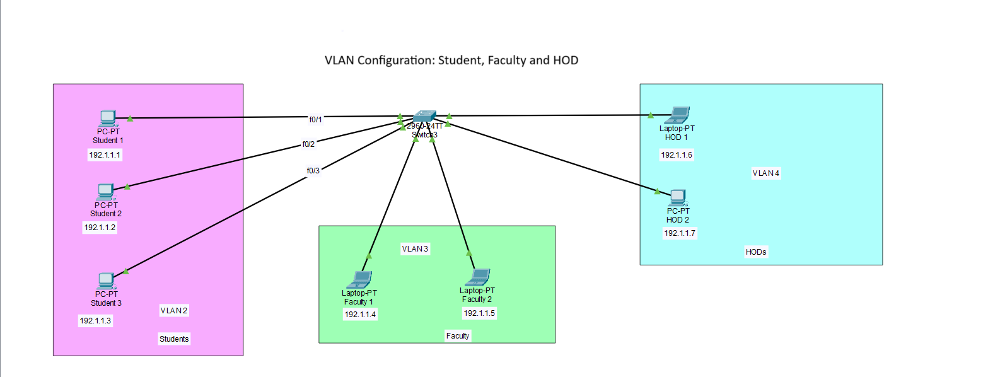
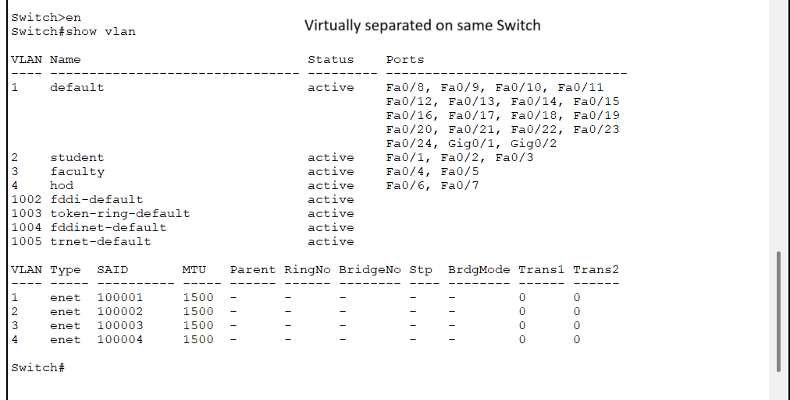

# VLAN Configuration Project

This project demonstrates basic VLAN configuration using Cisco Packet Tracer.

## 🎯 Objective
To create isolated network segments using VLANs for:
- Students (VLAN 2)
- Faculty (VLAN 3)
- HOD (VLAN 4)

## ⚙️ Configuration Summary

| VLAN | Name     | Assigned Ports     |
|------|----------|--------------------|
| 2    | student  | Fa0/1, Fa0/2, Fa0/3 |
| 3    | faculty  | Fa0/4, Fa0/5        |
| 4    | hod      | Fa0/6, Fa0/7        |

## 📸 Screenshots

## 📁 Files Included
- `vlan_project.pkt`: Packet Tracer file
- `topology.png`: Network layout
- `vlan_output.png`: CLI output showing VLAN config

---

✅ Project done as part of personal practice after completing CCNA modules on NetAcad.
